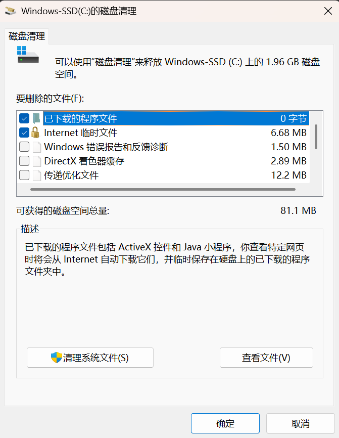
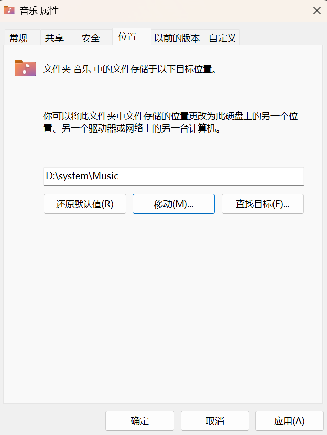
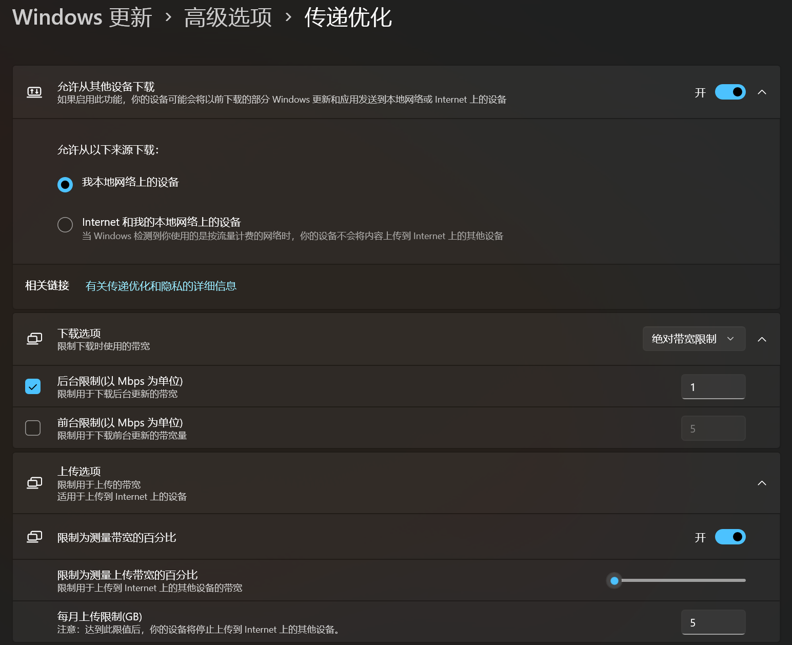
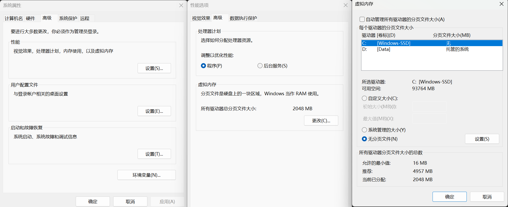

# C盘清理

---
*这里主要会介绍 **windows** 电脑的清理方案，注意是 windows!*

## 1 系统自带基础清理
这是windows电脑通用的解决办法，且由系统自带。
### 1.1 使用“存储感知”和“清理建议”
Windows 10/11 自带了非常智能的清理工具，可以按照如下操作：  

**打开： 设置 -> 系统 -> 存储。**  

开启“存储感知”，并点击进入“清理建议”。重点勾选“以前的 Windows 安装文件”（Windows.old），这通常是系统升级留下的备份，单个可能占用 20GB 以上，如果有其他系统建议长期未使用的文件，也可以进行删除清理。

### 1.2 磁盘清理
虽然存储感知很方便，但磁盘清理能扫描得更彻底，这通常是用于清理系统文件。  
**在搜索栏输入“磁盘清理” -> 右键 C 盘 -> 点击清理系统文件。**  


全部勾选即可，没有任何影响

## 2 个人文件夹迁移

这是一个非常彻底且一劳永逸的方法，它的核心原理是修改 Windows 系统的**注册表指向**，让系统认为 D 盘的某个文件夹才是真正的“桌面”或“文档”。  

假设当前的 Windows 账户登录名是 Tom,以下是带有详细路径的完整步骤：

### 2.1 系统默认位置

在默认情况下，Windows 会在 C 盘的用户目录下创建这些个人专属文件夹。它们的物理绝对路径如下：

* 桌面 (Desktop)：`C:\Users\Tom\Desktop`
* 文档 (Music)：`C:\Users\Tom\Documents`
* 下载 (Downloads)：`C:\Users\Tom\Downloads`
* 图片 (Pictures)：`C:\Users\Tom\Pictures`
* 视频 (Videos)：`C:\Users\Tom\Videos`
* 音乐 (Music)：`C:\Users\Tom\Music`
* 链接 (Links)：`C:\Users\Tom\Links`
* 收藏夹 (Favorites)：`C:\Users\Tom\Favorites`
* 搜索 (Searches)：`C:\Users\Tom\Searches`

所以桌面上的文件，真实的物理存储位置其实全都在 C 盘，它们都在消耗着系统盘的空间。

### 2.2 准备工作

!!!warning "注意"
    绝对不要在后续步骤中，直接将文件夹位置复制移动到 D 盘根目录。如果这么做了，整个 D 盘都会变成的“桌面”或“下载”，不仅视觉上极其混乱，而且很难恢复。

正确做法：先在目标盘建立好对应的文件夹。打开 D 盘（或其他空间充足的非系统盘），新建一个专用于存放个人文件的总文件夹，并在里面建好对应的子文件夹，例如：

* 新建 D 盘桌面存放点：`D:\system\Desktop`
* 新建 D 盘文档存放点：`D:\system\Document`


### 2.3 详细迁移步骤（以迁移“音乐”为例）

1. **找到目标文件夹：** 打开“此电脑”，在左侧导航栏找到 **“音乐”** 图标（或者直接进入 `C:\Users\Tom\Music` 找到该文件夹）。
2. **打开属性：** **右键**点击“文档”文件夹，在弹出的菜单中底部选择 **“属性”**。
3. **进入位置选项卡：** 在属性窗口顶部，点击 **“位置”** 标签页。此时可以看到上面显示的当前路径是 `C:\Users\Tom\Music`。
4. **指定新位置：** 点击下方的 **“移动(M)...”** 按钮。
5. **选择新路径：** 在弹出的浏览窗口中，找到刚才在准备工作中建好的目标文件夹：**`D:\system\Music`**，然后点击“选择文件夹”。




1. **确认应用：** 此时，“位置”标签页中的路径输入框应该已经变成了 `D:\system\Music`。点击右下角的 **“应用”**。
2. **转移文件（核心步骤）：** Windows 会立刻弹出一个提示框：
   > “是否要将所有文件从原位置移动到新位置？”
   > 旧位置：`C:\Users\Tom\Music`
   > 新位置：`D:\system\Music`
3. **点击“是(Y)”：** 系统会出现一个进度条，自动把原先“文档”里的所有资料（包括游戏存档、软件配置等）物理搬运到 D 盘的新文件夹里。

按照同样的步骤，可以依次把剩下的部分移动到其他盘。


## 3 temp 临时文件清理
!!!Note
    所有安装了 Windows 系统的电脑都可以（且建议）清理 temp 文件夹。  
    
这是一个操作系统级别的机制，与电脑的硬件品牌完全无关。无论使用的是联想、惠普、戴尔、华硕，还是自己组装的兼容机，只要运行的是 Windows 系统（Win10、Win11 甚至更老的版本），都会产生 temp文件。  
软件在安装、运行或解压时，会产生大量临时交换文件。理想情况下，软件关闭后应该自动删除它们，但由于程序崩溃或设计不规范，很多文件会被遗留在硬盘里，长年累月会吃掉 C 盘好几个 G 的空间。  
在 Windows 系统中，实际上有两个主要的临时文件夹需要清理，以下是详细的实操步骤：

### 3.1 清理用户级临时文件夹（%temp%）

这里存放的是当前登录的用户（例如 C:\Users\Tom\AppData\Local\Temp）在日常使用软件时产生的临时文件，通常也是垃圾最集中的地方。

详细步骤：
1. 打开运行窗口： 同时按下键盘上的 Win 键 和 R 键。  
2. 输入命令： 在弹出的运行窗口中，输入 %temp% （注意前后都有百分号，英文半角输入）。  
3. 确认打开： 点击“确定”或按回车键，系统会自动打开一个名为 Temp 的文件夹。  
4. 全选文件： 点击文件夹里的任意一个文件，然后按下 Ctrl + A 全选所有内容。  
5. 执行删除： 按下 Delete 键（如果想彻底删除不进回收站，按 Shift + Delete）。  
6. ⚠️ 关键操作（遇到“文件正在使用”怎么办）： 在删除过程中，系统大概率会弹窗提示“操作无法完成，因为其中的文件夹或文件已在另一程序中打开”。  
   * 原因： 这些是当前正在运行的软件（比如微信、VS Code 或浏览器）正在使用的临时文件，系统为了保护程序运行，不允许删除。  
   * 应对： 勾选提示框左下角的 “为所有当前项目执行此操作”，然后点击 “跳过” 即可。能删的删掉，不能删的直接留在那里，非常安全。  


### 3.2 清理系统级临时文件夹（temp）

这里存放的是 Windows 系统本身（例如 C:\Windows\Temp）在更新、运行系统服务时产生的临时文件。

具体步骤：
1. 打开运行窗口： 再次按下 Win + R 键。  
2. 输入命令： 这次去掉百分号，只输入 temp。  
3. 获取权限： 点击“确定”后，如果系统弹窗提示“当前无权访问该文件夹”，请直接点击 继续（需要有这台电脑的管理员权限）。  
4. 全选并删除： 同样进入文件夹后，按下 Ctrl + A 全选，再按 Delete 删除。  
5. 跳过占用文件： 遇到提示“文件正在使用”的弹窗，依然勾选“为所有当前项目执行此操作”，然后点击 “跳过”。  

定期（比如每个月）执行这两步操作，能够非常安全、有效地回收 C 盘的存储空间。  

## 4 特定电脑清理

### 4.1 HP电脑驱动备份文件夹 (C:\swsetup)
HP 电脑通常有一个特有的文件夹叫 C:\swsetup。  
这里存放的是 HP 预装软件和驱动的解压安装包。可以直接在D盘下开一个D:\system\swsetup_backup文件夹，把这个swsetup放进去。下次有系统更新的时候，把C盘新产生的文件再放到D:\system\swsetup_backup里。

### 4.2 Lenovo电脑驱动备份文件夹 (C:\Drivers)
Lenovo 电脑通常有一个特有的文件夹叫 C:\Drivers。  
这里存放的是 Lenovo 预装软件和驱动的解压安装包。可以直接在D盘下开一个D:\system\Drivers_backup文件夹，把这个Drivers放进去。下次有系统更新的时候，把C盘新产生的文件再放到D:\system\Drivers_backup里。


### 4.3 卸载 OEM 预装软件（Bloatware）
部分品牌电脑通常预装了很多试用版软件。  
进入“设置 -> 应用 -> 安装的应用”。  
卸载如麦卡菲（McAfee）试用版、不常用工具（如 HP/lenovo Support Assistant 的缓存）。

## 5 进阶深度优化（强烈不推荐方案）

### 5.1 关闭休眠文件（部分电脑）
Windows 会为了实现快速启动而预留一块硬盘空间（hiberfil.sys），大小通常与的内存相近。如果关闭后我们电脑就只能“睡眠”，而不能“休眠”了（本人觉得无所谓哈）
1. 按下键盘 Win + S，搜索 “CMD” 或 “命令提示符”。
2. 必须点击右侧的 “以管理员身份运行”（否则会提示权限不足）。
3. 在黑色窗口中输入以下命令并回车：
```DOS
powercfg -h off
```

回车后没有任何文字提示即代表成功。此时可以立刻观察 C 盘的可用空间，应该会释放了好几个 GB。

### 5.2 清理传递优化文件
Windows 会为了给局域网其他设备分发更新而保留补丁备份。  
设置 -> Windows 更新 -> 高级选项 -> 传递优化。

按照下图的设置即可：



### 5.3 虚拟内存管理
**操作路径：** 设置 -> 系统 -> 关于 -> 高级系统设置 -> 高级（性能设置） -> 高级（更改虚拟内存）。  
取消勾选“自动管理”，点击 C 盘选“无分页文件”并点“设置”；点击 D 盘选“系统管理的大小”并点“设置”，如下图所示：



## 6 一些辅助工具

有些第三方软件的缓存非常隐蔽，下面建议使用一些工具：

* WizTree ： 扫描速度极快，能用方块大小展示文件占用的空间。
* SpaceSniffer： 以热力图形式展现文件夹结构。
* Geek：非常好用的删除工具，本人强推。
